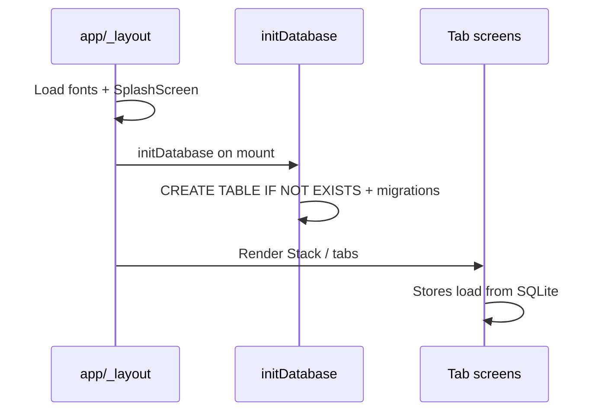
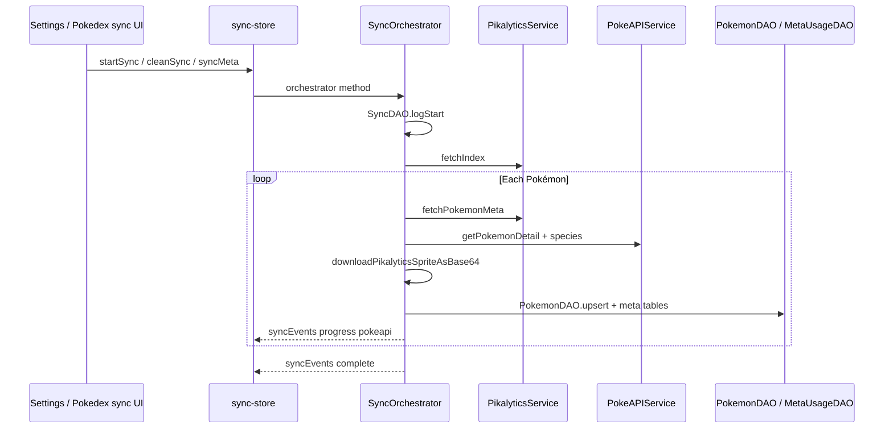

# Data flow

## Startup

1. `SplashScreen.preventAutoHideAsync()` until fonts load.
2. `initDatabase()` runs once in root layout (non-blocking `.catch`).
3. Tab screens call `loadPokemons()`, `loadMyTeam()`, etc. on focus or mount.

## Full sync flow

**Phase naming in UI:** Phase 2 emits `phase: 'pokeapi'` in progress events (historical label); work is driven by the Pikalytics index.

## Pokédex read path

1. `usePokemonStore.loadPokemons()` → `PokemonDAO.getAllByUsageRank()`.
2. Search with query length > 2 → `PokemonDAO.search()` (FTS5 when available).
3. Detail screen → `PokemonDAO.getById()` + related meta from `MetaUsageDAO`.

## Team import path

1. User pastes Showdown text → `TeamService.importFromPokepaste`.
2. `PokepasteParser.parse` → array of `ParsedPokemon`.
3. Missing species: if offline, error; if online, `SyncOrchestrator.fetchAndStoreSinglePokemon`.
4. `TeamDAO.createTeam` + members with resolved or raw item/ability names.
5. Move stubs created via `MoveDAO` when needed.

## Battle preview path

1. `useBattleStore.loadMyTeam()` reads active team from `TeamDAO`.
2. User fills six enemy slots (session-only, not persisted).
3. `recompute()` → `buildHeatmap`, `compareSpeed` (with `MetaUsageDAO.getTopItems` for Scarf), `generateAlerts`.
4. UI binds to `heatmap`, `speedComparisons`, `alerts`.

## State vs persistence

| Data | Storage |
|------|---------|
| Pokédex, meta usage | SQLite |
| User teams | SQLite |
| Enemy team in battle | Zustand only (session) |
| Sync progress | Zustand (ephemeral) |

## Related files

- `app/_layout.tsx`
- `src/services/sync-orchestrator.ts`
- `src/stores/*.ts`
- `src/database/database.ts`

*Last verified against code: 2026-06-01*
