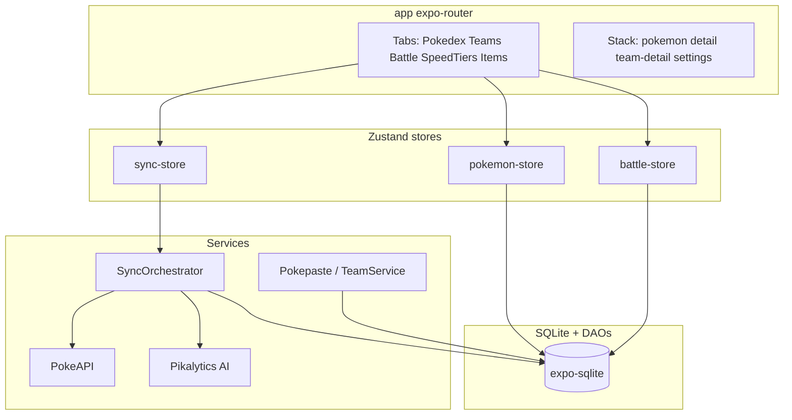

# Architecture overview

## Purpose

Mobile competitive Pokémon (VGC / Champions format) assistant: local Pokédex, team import from Showdown paste, item catalog, battle preview analysis, and speed tier comparisons. All game data is offline-first in SQLite after sync.

## Stack

| Layer | Technology | Version (see `package.json`) |
|-------|------------|------------------------------|
| Runtime | Expo | ~54.0.33 |
| UI | React Native | 0.81.5 |
| Language | TypeScript | ~5.9.2 |
| Routing | expo-router | ~6.0.23 |
| Database | expo-sqlite | ~16.0.10 |
| State | Zustand | ^5.0.12 |
| HTTP | axios, axios-rate-limit | — |
| HTML parsing | cheerio | Serebii scraper |
| Events | eventemitter3 | Sync progress |
| Images | expo-image | Sprites in UI |
| Animation | react-native-reanimated, gesture-handler | — |

## Layered architecture



## Project layout

```
pokemon-champions-app/
├── app/                 # expo-router screens and layouts
├── src/
│   ├── components/      # Shared UI (+ battle/)
│   ├── config/          # URLs, sync thresholds
│   ├── database/        # SQLite init + DAOs
│   ├── models/          # TypeScript domain types
│   ├── services/        # Sync, APIs, import
│   ├── stores/          # Zustand
│   └── utils/           # Battle engine, type chart, lists
├── components/          # Expo template (Themed, useColorScheme)
├── constants/           # Colors
├── assets/              # Fonts, images
└── docs/                # This documentation tree
```

## Offline model

- **Read path:** Screens and stores read from SQLite only (no network required after sync).
- **Write path (user):** Teams and members persist in SQLite; never dropped by `resetDatabase()`.
- **Write path (sync):** `SyncOrchestrator` fetches Pikalytics index + per-Pokémon meta, enriches with PokeAPI, stores Base64 sprites locally.
- **On-demand fetch:** Team import can call `fetchAndStoreSinglePokemon` when online and a species is missing.

## Related documentation

- [Data flow](data-flow.md)
- [Navigation](navigation.md)
- [Database schema](../database/schema.md)
- [Sync overview](../services/sync-overview.md)

*Last verified against code: 2026-06-01*
