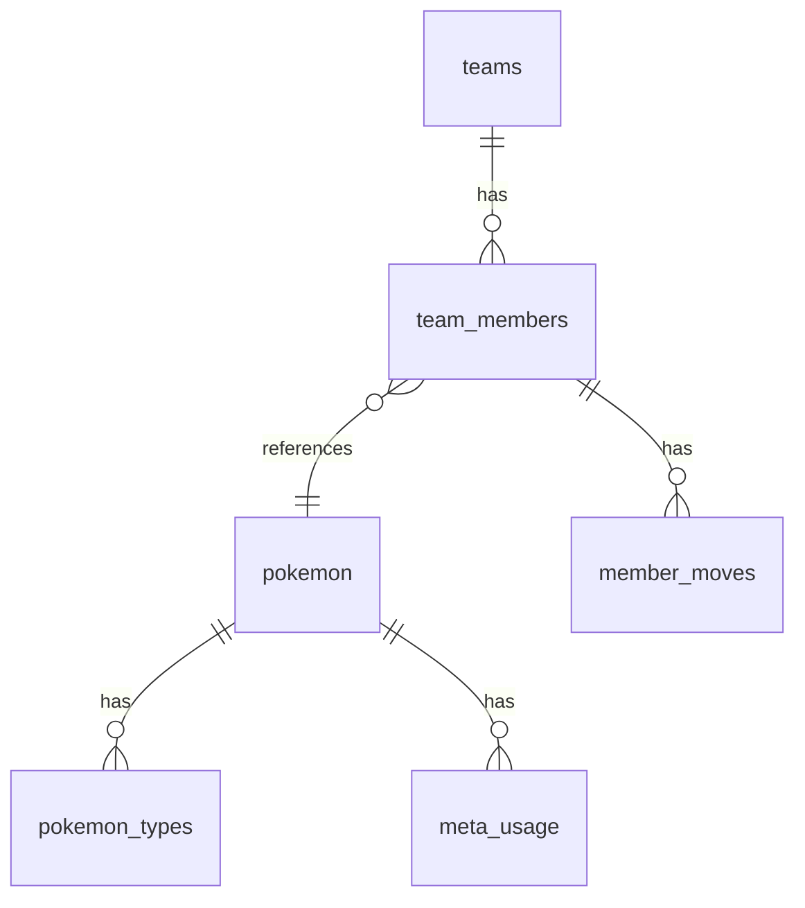

# Database schema

## Purpose

SQLite schema for offline Pokédex, competitive meta, and user teams. Database file: `champions_dex.db` (`DB_NAME` in config).

## Core Pokédex tables

### `pokemon`

| Column | Type | Notes |
|--------|------|-------|
| id | INTEGER PK | Auto-increment |
| dex_number | INTEGER | From PokeAPI when available |
| name | TEXT UNIQUE | Pikalytics display name (e.g. `Rotom-Wash`) |
| form | TEXT | Derived from name suffix |
| description | TEXT | Species flavor (es/en) |
| is_mega | INTEGER | 0/1 |
| hp, attack, defense, sp_attack, sp_defense, speed, total | INTEGER | Base stats |
| height, weight | REAL | Decimeters / hectograms from API |
| sprite_default, sprite_shiny, sprite_icon | TEXT | Often Base64 from Pikalytics CDN |
| category | TEXT | Optional |
| usage_pct, usage_rank | REAL, INTEGER | From Pikalytics index |

### `pokemon_types`

Composite PK `(pokemon_id, slot)` — `type_name`, slot 1 or 2.

### `abilities` / `pokemon_abilities`

Global ability catalog and many-to-many with `is_hidden`.

### `moves` / `pokemon_moves`

`pokemon_moves` uses `move_name` + `method` (not only move id).

### `items` / `pokemon_items`

Competitive item catalog and species relations.

## Meta tables (Pikalytics)

### `meta_usage`

Per-Pokémon competitive usage for moves, abilities, items.

| Column | Notes |
|--------|-------|
| category | `'move'`, `'ability'`, or `'item'` |
| name | Display name |
| usage_pct | Filtered at sync by `MIN_USAGE_PCT` (default 5%) |
| UNIQUE(pokemon_id, category, name) | |

### `meta_teammates`

PK `(pokemon_name, teammate_name)` — common teammates and usage %.

### `featured_teams`

Sample teams from meta: `player`, `record`, `event`, `team_members` (serialized), focus ability/item/moves.

## User team tables (preserved on reset)

### `teams`

`name`, `is_active`, `created_at`.

### `team_members`

Links to `pokemon_id`, optional `item_id` / `ability_id`, or `raw_item_name` / `raw_ability_name`, `nature`, `evs`, `ivs`, `level`, `slot`, `team_order`. `ON DELETE CASCADE` from team.

### `member_moves`

`(member_id, move_id)` with cascade delete.

## Sync tables

### `sync_log`

Audit: `phase`, `records_total`, `records_ok`, `records_error`, `status`, `error_detail`.

### `sync_metadata`

Key-value store (e.g. `pikalytics_last_sync`).

## Search

### `pokemon_fts`

FTS5 virtual table on `name`, `dex_number` with triggers `pokemon_ai`, `pokemon_ad`, `pokemon_au`. Optional — creation wrapped in try/catch.

## ER diagram (simplified)

## Related files

- `src/database/database.ts`
- `src/database/dao/*.ts`

See [migrations.md](migrations.md), [daos.md](daos.md).

*Last verified against code: 2026-06-01*
