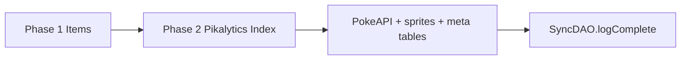

# Sync overview

## Purpose

`SyncOrchestrator` coordinates full and partial data synchronization from local item lists, Pikalytics AI, and PokeAPI into SQLite. Progress is broadcast via `syncEvents` (`eventemitter3`).

## Public API

| Method | Description |
|--------|-------------|
| `startSync()` | Full sync: items + Pikalytics-indexed Pokédex |
| `cleanSync()` | `resetDatabase()` then `startSync()` |
| `syncPikalytics(force?)` | Meta-only refresh; 7-day cooldown unless `force` |
| `fetchAndStoreSinglePokemon(name)` | On-demand species for team import |
| `getMissingPokemon(names)` | Names not in local DB |

## Events

| Event | Payload |
|-------|---------|
| `progress` | `{ phase, current, total }` — `phase`: `'items'`, `'pokeapi'`, or `'pikalytics'` |
| `complete` | none |
| `error` | error message string |

Subscribers: `useSyncStore` (constructor-time listeners).

## Flow diagram

## Configuration

From `META_SYNC_CONFIG`:

- `MIN_USAGE_PCT`: 5` — meta rows stored at or above this threshold in full sync
- `SYNC_INTERVAL_DAYS`: 7` — auto `syncPikalytics` skip window
- `RATE_LIMIT_DELAY`: 300` ms between Pokémon in Phase 2

## Related documentation

- [sync-phase-items.md](sync-phase-items.md)
- [sync-phase-pokedex.md](sync-phase-pokedex.md)
- [pikalytics.md](pikalytics.md)
- [pokeapi.md](pokeapi.md)
- [images.md](images.md)

## Related files

- `src/services/sync-orchestrator.ts`
- `src/stores/sync-store.ts`
- `src/database/dao/sync.dao.ts`

*Last verified against code: 2026-06-01*
