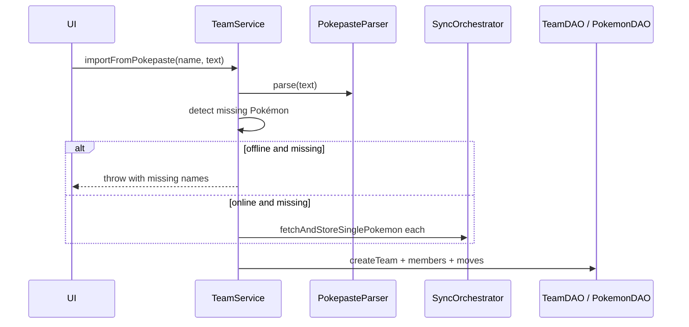

# Team import service

## Purpose

`TeamService.importFromPokepaste` converts Showdown paste text into a persisted user team in SQLite.

## Flow

## Pre-flight missing Pokémon

For each parsed species, `PokemonDAO.getByName`. Collect missing:

- **Offline:** throw `Internet connection required...` with name list.
- **Online:** `fetchAndStoreSinglePokemon` for each; `'error'` results may skip member.

## Resolution rules

| Entity | Found in DB | Not found |
|--------|-------------|-----------|
| Pokémon | use id | skip member if still missing after fetch |
| Item | `item_id` | `raw_item_name` on member |
| Ability | `ability_id` | `raw_ability_name` |
| Move | `move_id` or create stub | stub via MoveDAO |

## Return value

Team id (`number`) from `TeamDAO.createTeam`.

## Related files

- `src/services/team-service.ts`
- `src/services/pokepaste-parser.ts`
- `src/utils/network.ts` (`isOnline`)
- `app/(tabs)/teams.tsx` (UI entry)

*Last verified against code: 2026-06-01*
